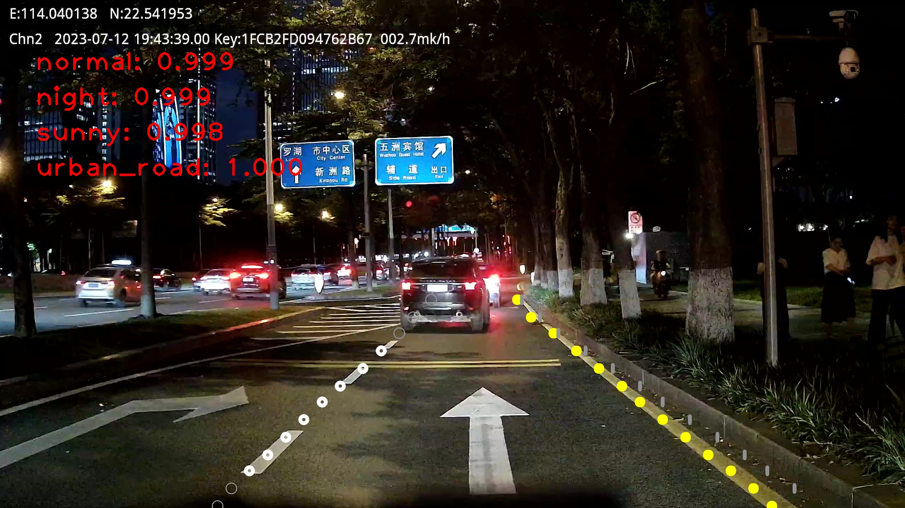
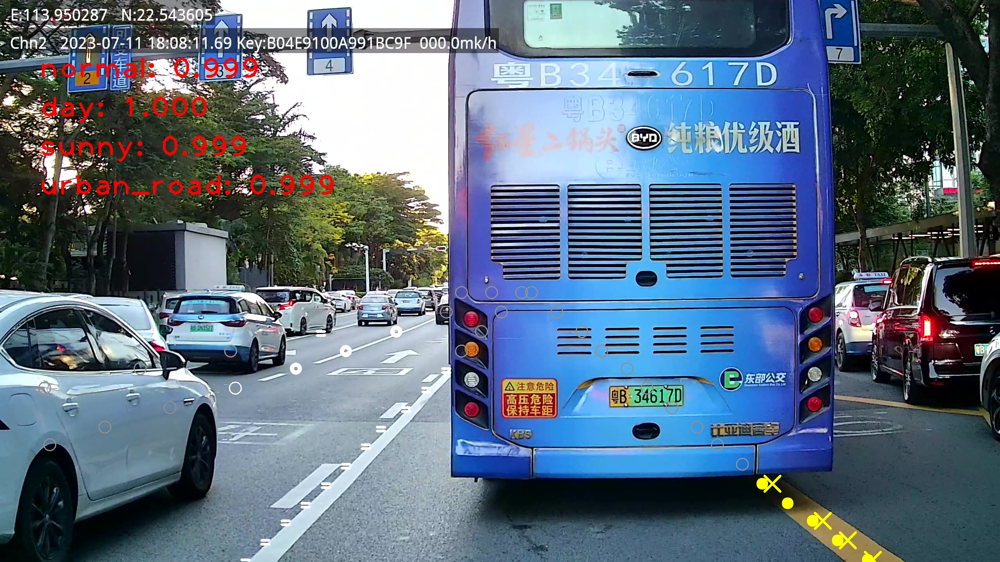

# Ultra-Fast-Lane-Detection-Attributes

本项目fork自官方[Ultra-Fast-Lane-Detection](https://github.com/cfzd/Ultra-Fast-Lane-Detection)，旨在解决其只能预测车道线的位置，而无法得到车道线对应的颜色、功能和类别的问题。

## 功能特性
本项目主要应用场景是车载视角的车道线识别，可以识别出当前车辆是否处于车道线内行驶的正常状态（status）、目前的天气（weather）、周边环境（environmet）、光线情况（lighting）以及左右三条车道线在每一行的位置（x_values）、种类（type）、功能（func）、颜色（color），可以识别的类别有：
- 状态（status）：正常行驶、不正常行驶
- 天气（weather）：天晴、下雨、下雪、多云、未知
- 周边环境（environment）：室内道路、封闭道路、城市道路、隧道、其他
- 光线情况（light）：白天、晚上、其他
- 位置（x_value）：不存在（-1），0～199
- 种类（type）：虚线、实线、网格线、导流线、特殊虚线、特殊实线、道路边沿、填充线
- 功能（func）：普通车道分隔、对向车道分隔、道路边缘分隔、非机动车道分隔、应急车道分隔、公交车站分隔、公交车站分隔
- 颜色（color）：黄色、白色、红色、蓝色、无颜色

## 实现细节

原本的版本是[这篇论文](https://arxiv.org/abs/2004.11757)的实现，大致的原理是利用 num_x_grid×num_y_grid 的网格覆盖整个图像，然后每一行预测车道线所在的列，那个交点就是该条车道线在这行所在的位置，如图所示，为了可以得到该车道线在那个位置的颜色、种类和功能，从 backbone 的输出降维后的 lane_feature_head 用四个全连接层进行属性的输出，同样的为了获得全局特征，另外使用一个 global_cls_head 来输出四个全局特征。


```python
# backbone 提特征
x2, x3, x4 = self.model(x)

# 全局特征从 x4 进行降维
global_cls_head = self.global_cls_pool(x4)    
global_cls_head = global_cls_head.view(global_cls_head.size(0), -1)

# 全连接输出四个状态向量
status_cls = self.status_cls(global_cls_head).view(-1, 2)
lighting_cls = self.lighting_cls(global_cls_head).view(-1, 3)
weather_cls = self.weather_cls(global_cls_head).view(-1, 5)
env_cls = self.env_cls(global_cls_head).view(-1, 5)

# 线的特征从 x4 进行降维
lane_feature_head = self.lane_feature_pool(x4)
lane_feature_head = lane_feature_head.view(lane_feature_head.size(0), -1)

# 全连接输出四个线的特征向量
x_values = self.x_value(lane_feature_head).view(-1, *self.objectness_dim)
color_cls = self.color_cls(lane_feature_head).view(-1, *self.color_dim) 
func_cls = self.func_cls(lane_feature_head).view(-1, *self.func_dim) 
type_cls = self.type_cls(lane_feature_head).view(-1, *self.type_dim) 
```

## 训练
所有训练相关配置都在 configs/chezai_lane.py 中调整，可以在这里修改需要的数据增强方法
```python
if(self.augment):
    img = augment_hsv(img)  
    img = hist_equalize(img) 
    img = cutout(img) 
    img, label = cutoutBackground(img, label)
    img, label = random_perspective(img, label)
```

单 GPU 训练
```
python train.py  --config configs/chezai_lane.py 
```

多 GPU 训练（推荐）
```
sh launch_training.sh
```

## 结果展示
```python
python demo.py --config ./configs/chezai_lane.py --demo_weights weight_path --demo_path demo_video_path
```



